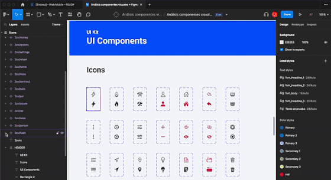

# Figma-icons-tokens

Figma-icons-tokens aims to import figma icons given a design tokens configuration file exposed by [Tokens Studio Figma](https://tokens.studio/).

## Installation

```
npm install figma-icons-tokens
```

## Example

``` 
figma-icons-tokens --file=tokens.json --theme=global --key=icon --path=assets
```

Options flags command line:

| Flags | Description                                         |
| ----- | --------------------------------------------------- |
| file  | File Configuration                                  |
| theme | Theme name where the icons to import are specified. |
| key   | Key where the icons to import are located.          |
| path  | Path where the imported icons should be exposed.    |


Initially, the link to be copied must be the node above the vector that defines the icon. To guarantee the correct display of the icon, it must be a single vector.



Define an environment variables file with the authorization token and figma file id:

```

FIGMA_TOKEN=figX_XXXXXXXXXXXXXXXXXXX-XXX

```

For the correct operation of the library, It is necessary to present a configuration file with the structure defined in the Figma Studio Tokens standard and the link obtained from the icons to import. It is also possible to nest the same icons based on the different sizes by breaking points of this.

```
{
    "global": {
        "icon": {
            "delete": {
                "xs": {
                    "value": "https://www.figma.com/file/XXXXXXXXXXX/An%C3%A1lisis-componentes-visuales-%2B-Figma?node-id=6%3A87&t=vc9GOS1lovXQoneW-4",
                    "type": "asset"
                },
                "md": {
                    "value": "https://www.figma.com/file/XXXXXXXXXXX/An%C3%A1lisis-componentes-visuales-%2B-Figma?node-id=6%3A87&t=vc9GOS1lovXQoneW-4",
                    "type": "asset"
                },
                "lg": {
                    "value": "https://www.figma.com/file/XXXXXXXXXXX/An%C3%A1lisis-componentes-visuales-%2B-Figma?node-id=6%3A87&t=vc9GOS1lovXQoneW-4",
                    "type": "asset"
                }
            },
            "add": {
                "value": "https://www.figma.com/file/XXXXXXXXXXX/An%C3%A1lisis-componentes-visuales-%2B-Figma?node-id=6%3A87&t=vc9GOS1lovXQoneW-4",
                "type": "asset"
            },
            "next": {
                "value": "https://www.figma.com/file/XXXXXXXXXXX/An%C3%A1lisis-componentes-visuales-%2B-Figma?node-id=6%3A87&t=vc9GOS1lovXQoneW-4",
                "type": "asset"
            },
            "previous": {
                "value": "https://www.figma.com/file/XXXXXXXXXXX/An%C3%A1lisis-componentes-visuales-%2B-Figma?node-id=6%3A87&t=vc9GOS1lovXQoneW-4",
                "type": "asset"
            }
        }
    },
    "$themes": [],
    "$metadata": {
        "tokenSetOrder": [
            "global"
        ]
    }
}
```

## Node.js API

You can use this module as a node module.

```
const figma = require('figma-icons-tokens');
```

### figmaIconsTokens ({theme: string, path: string, file: string, key: string}) : Promise<{path: string; name: string}[]>
```
const [figma, argv] = [
  require('figma-icons-tokens')
  require('minimist')(process.argv.slice(2)),
];

const { tokens, theme, path } = argv;
const { figmaIconsTokens } = figma;

figmaIconsTokens({ theme, path, file: tokens, key: 'icons' })
  .then((ev) => console.log(ev))
  .catch((error) => console.error(error))
```

| Args | Type | Description                                         |
| ----- | ----  | --------------------------------------------------- |
| file  | String | File Configuration                                  |
| theme | String | Theme name where the icons to import are specified. |
| key   | String | Key where the icons to import are located.          |
| path  | String | Path where the imported icons should be exposed.    |

## Changelog

[Github Releases](https://github.com/Jsamper92/figma-icons-tokens/tags)

## Contributing

Thanks for contributing to figma-icons-tokens development!
Feature requests and bug reports can be filed on [Github](https://github.com/Jsamper92/figma-icons-tokens)

If you are contributing code with new features or bug-fixes:

- Fork the project, and create a branch for your contribution.
- Follow the development guide below to get figma-icons-tokens to work.
- Open a pull request on [Github](https://github.com/Jsamper92/figma-icons-tokens/issues)

## Development

To install the necessary Node dependencies, run `npm install`.

## License

[MIT License](LICENSE) © [Javier Samper Arias](https://github.com/Jsamper92)