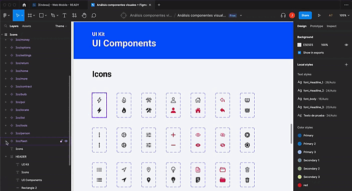

# Figma-icons-tokens

Figma-icons-tokens aims to import figma icons given a design tokens configuration file exposed by [Tokens Studio Figma](https://tokens.studio/).

To use the library we must follow the following steps:

1. Run the command ```npm install figma-icons-tokens```
2. Create a script in the package.json where we will pass the configuration file ```figma-icons-tokens --file=tokens.json --theme=global --key=icon --path=assets```

Options flags command line:

| Flags | Description                                                    |
| ----- | -------------------------------------------------------------- |
| file  | File Configuration |
| theme | Theme name where the icons to import are specified. |
| key | Key where the icons to import are located. |
| path | Path where the imported icons should be exposed. |


Initially, the link to be copied must be the node above the vector that defines the icon. To guarantee the correct display of the icon, it must be a single vector.



Define an environment variables file with the authorization token and figma file id:
```

FIGMA_TOKEN=figX_XXXXXXXXXXXXXXXXXXX-XXX
FILE_KEY=XXXXXXXXXXXXXXXX

```

For the correct operation of the library, it is necessary to create a configuration with the following structure:

```
{
  "global": {
    "icon":{
      "delete": {
        "value": "https://www.figma.com/file/XXXXXXXXXXX/An%C3%A1lisis-componentes-visuales-%2B-Figma?node-id=6%3A87&t=vc9GOS1lovXQoneW-4",
        "type": "asset"
      },
      "add": {
        "value": "https://www.figma.com/file/XXXXXXXXXXX/An%C3%A1lisis-componentes-visuales-%2B-Figma?node-id=6%3A87&t=vc9GOS1lovXQoneW-4",
        "type": "asset"
      },
      "next": {
        "value": "https://www.figma.com/file/XXXXXXXXXXX/An%C3%A1lisis-componentes-visuales-%2B-Figma?node-id=6%3A87&t=vc9GOS1lovXQoneW-4",
        "type": "asset"
      },
      "previous": {
        "value": "https://www.figma.com/file/XXXXXXXXXXX/An%C3%A1lisis-componentes-visuales-%2B-Figma?node-id=6%3A87&t=vc9GOS1lovXQoneW-4",
        "type": "asset"
      }
    }
  },
  "$themes": [],
  "$metadata": {
    "tokenSetOrder": [
      "global"
    ]
  }
}
```

## Contributing

Thanks for contributing to figma-icons-tokens development!
Feature requests and bug reports can be filed on [Github](https://github.com/Jsamper92/figma-icons-tokens)

If you are contributing code with new features or bug-fixes:
- Fork the project, and create a branch for your contribution.
- Follow the development guide below to get figma-icons-tokens to work.
- Open a pull request on [Github](https://github.com/Jsamper92/figma-icons-tokens/issues)

## Development
To install the necessary Node dependencies, run ```npm install```.